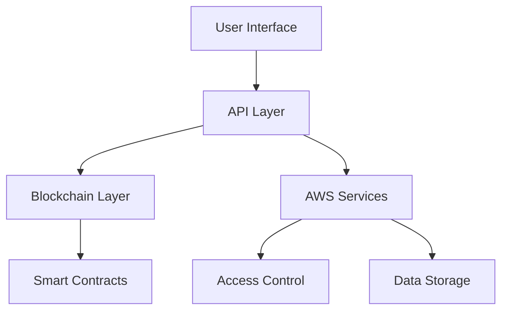

# Field 2 Table (f2t.io)

[](https://opensource.org/licenses/MIT)
[](http://makeapullrequest.com)

A blockchain-driven marketplace ecosystem that revolutionizes local food commerce through dynamic NFT-based access control and farm share management.

## 🌟 Features

### Core Technologies
- 🔗 **Blockchain Integration** - Smart contracts for farm share management and compliance automation
- 🎫 **Dynamic NFTs** - Role-based access tokens with real-time attribute updates
- ☁️ **AWS RBAC/ABAC** - Hybrid access control system leveraging NFT attributes
- 📍 **Geolocation Services** - Proximity-based compliance enforcement
- 🔐 **Smart Contracts** - Automated compliance and transaction validation

### Key Components
- **NFT-Based Access Control** - Dynamic attribute management for roles and permissions
- **Farm Share Framework** - Legal structure for regulated goods distribution
- **Compliance Automation** - Real-time verification of regulatory requirements
- **Audit Trail** - Immutable transaction records for regulatory oversight

## 🚀 Getting Started

### Prerequisites
- Node.js v18+
- AWS CLI configured
- Blockchain wallet (MetaMask recommended)

### Quick Start
```bash
# Clone the repository
git clone https://github.com/yourusername/f2t.io.git

# Install dependencies
cd f2t.io
npm install

# Configure environment
cp .env.example .env
# Edit .env with your credentials

# Run development server
npm run dev
```

## 📖 Documentation

- [System Architecture](./docs/architecture.md)
- [Access Control Specification](./docs/accessControlSystem.md)
- [Smart Contract Documentation](./docs/smartContracts.md)
- [AWS Integration Guide](./docs/awsIntegration.md)
- [API Reference](./docs/apiReference.md)

## 🤝 Contributing

We welcome contributions! Please see our [Contributing Guide](CONTRIBUTING.md) for details on:
- Code of Conduct
- Development process
- Pull request guidelines
- Community guidelines

## 📜 License

This project is licensed under the MIT License - see the [LICENSE](LICENSE) file for details.

## 🔗 Links

- [Website](https://f2t.io)
- [Documentation](https://docs.f2t.io)
- [White Paper](https://f2t.io/whitepaper)

## 🏗️ Project Status

Field 2 Table is currently in active development. Key milestones:

- [x] Core architecture design
- [x] NFT access control implementation
- [x] AWS RBAC/ABAC integration
- [ ] Smart contract auditing
- [ ] Beta testing
- [ ] Production deployment

## 🙏 Acknowledgments

Special thanks to:
- Local food producers who provided invaluable insights
- Regulatory experts who helped shape compliance features
- Open source projects that made this possible

## 📊 Technical Architecture



## 💡 Core Concepts

### Dynamic NFT Access Control
NFTs serve as dynamic attribute carriers, enabling:
- Real-time permission updates
- Compliance status tracking
- Geographic restriction enforcement
- Transaction limit management

### Farm Share Framework
Legal structure allowing:
- Cross-border commerce
- Regulated goods distribution
- Compliance automation
- Transparent ownership tracking

## 📞 Contact

- [Twitter](https://twitter.com/f2t_io)
- Email: support@f2t.io

---
Built with ❤️ for local food communities