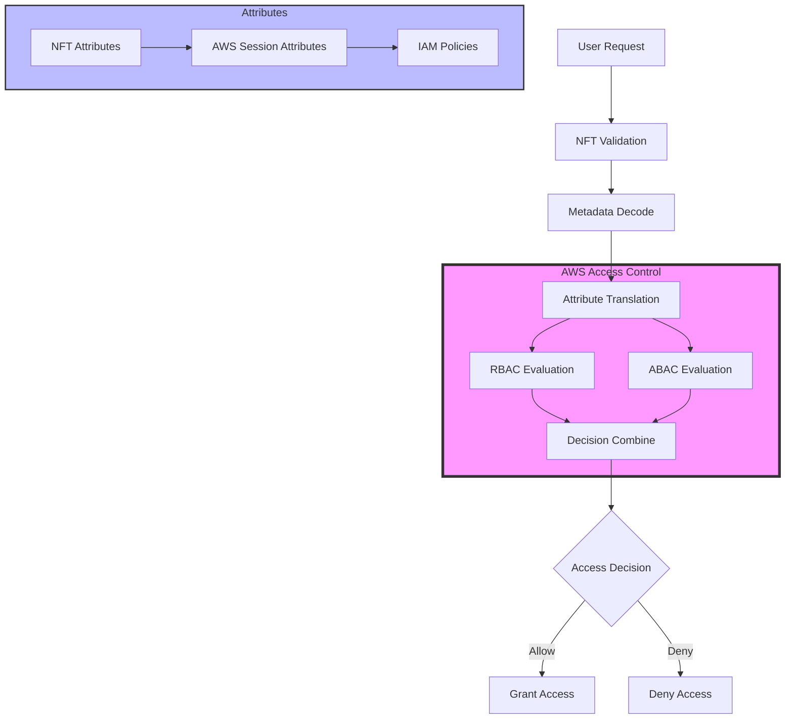
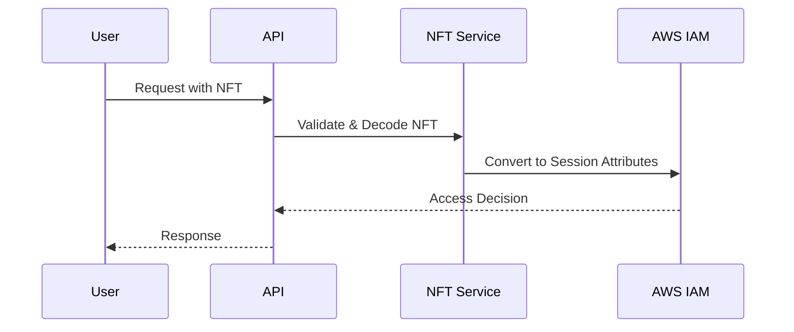

# Field 2 Table (f2t.io) Access Control System
## Technical Specification for NFT-Based Dynamic Access Control

## Table of Contents
- [Overview](#overview)
- [System Architecture](#system-architecture)
- [NFT Layer](#1-nft-layer)
- [AWS Integration](#2-aws-integration)
- [Access Control Flow](#3-access-control-flow)
- [Implementation Guidelines](#4-implementation-guidelines)
- [Error Handling](#5-error-handling)
- [Monitoring and Metrics](#6-monitoring-and-metrics)
- [Appendix](#appendix)

## Overview
This specification defines the integration between NFT-based dynamic attributes and AWS RBAC/ABAC for the Field 2 Table marketplace platform. The system combines the flexibility of blockchain-based NFTs with AWS's robust access control infrastructure.

## System Architecture



## 1. NFT Layer

### 1.1 NFT Structure
```json
{
    "tokenId": "unique-identifier",
    "type": "access-control",
    "attributes": {
        "role": "producer|consumer|administrator|auditor|developer",
        "compliance": {
            "status": "verified|pending|suspended",
            "lastVerified": "ISO-8601-timestamp",
            "jurisdiction": ["MI", "OH"]
        },
        "geolocation": {
            "allowedRegions": ["us-michigan", "us-ohio"],
            "salesRadius": "100mi"
        },
        "limits": {
            "transactionCap": "75000",
            "periodStart": "ISO-8601-timestamp",
            "periodEnd": "ISO-8601-timestamp"
        },
        "environmental": {
            "allowedHours": ["09:00-17:00"],
            "timezone": "America/Detroit"
        }
    },
    "metadata": {
        "version": "1.0",
        "lastUpdated": "ISO-8601-timestamp"
    }
}
```

### 1.2 Dynamic Updates
The system supports real-time updates through:
- Compliance verification events
- Transaction monitoring
- Geolocation changes
- Administrative actions

## 2. AWS Integration

### 2.1 RBAC Base Roles

#### Producer Role
```json
{
    "Version": "2012-10-17",
    "Statement": [
        {
            "Effect": "Allow",
            "Action": [
                "f2t:CreateListing",
                "f2t:UpdateListing",
                "f2t:ViewOrders",
                "f2t:FulfillOrder"
            ],
            "Resource": "*",
            "Condition": {
                "StringEquals": {
                    "f2t:role": "producer",
                    "f2t:complianceStatus": "verified"
                }
            }
        }
    ]
}
```

#### Consumer Role
```json
{
    "Version": "2012-10-17",
    "Statement": [
        {
            "Effect": "Allow",
            "Action": [
                "f2t:ViewListings",
                "f2t:PlaceOrder",
                "f2t:ViewOrderHistory"
            ],
            "Resource": "*",
            "Condition": {
                "StringEquals": {
                    "f2t:role": "consumer"
                }
            }
        }
    ]
}
```

#### Auditor Role
```json
{
    "Version": "2012-10-17",
    "Statement": [
        {
            "Effect": "Allow",
            "Action": [
                "f2t:ViewTransactionLogs",
                "f2t:ViewComplianceRecords"
            ],
            "Resource": "*",
            "Condition": {
                "StringEquals": {
                    "f2t:role": "auditor",
                    "f2t:jurisdiction": "${aws:RequestTag/region}"
                }
            }
        }
    ]
}
```

### 2.2 ABAC Policies

#### Geographic Access Control
```json
{
    "Version": "2012-10-17",
    "Statement": [
        {
            "Effect": "Allow",
            "Action": "f2t:ViewListing",
            "Resource": "*",
            "Condition": {
                "NumericLessThanEquals": {
                    "f2t:distance": "${aws:RequestTag/salesRadius}"
                },
                "StringEquals": {
                    "f2t:region": "${aws:RequestTag/allowedRegions}"
                }
            }
        }
    ]
}
```

#### Transaction Limits
```json
{
    "Version": "2012-10-17",
    "Statement": [
        {
            "Effect": "Allow",
            "Action": "f2t:ProcessTransaction",
            "Resource": "*",
            "Condition": {
                "NumericLessThanEquals": {
                    "f2t:transactionTotal": "${aws:RequestTag/remainingCap}"
                }
            }
        }
    ]
}
```

## 3. Access Control Flow

### 3.1 Authentication Process
1. User initiates request with NFT token
2. System validates NFT authenticity
3. NFT metadata decoded and converted to AWS session attributes
4. AWS evaluates RBAC and ABAC policies
5. Access granted or denied based on combined evaluation

### 3.2 Session Management


## 4. Implementation Guidelines

### 4.1 NFT Updates
- Use events system for attribute updates
- Maintain version history in metadata
- Implement rate limiting for updates
- Cache frequently accessed attributes

### 4.2 AWS Configuration
- Use AWS Organizations for multi-region setup
- Implement Service Control Policies (SCPs)
- Configure CloudWatch monitoring
- Set up AWS Config rules

### 4.3 Security Considerations
- Implement NFT signature verification
- Use AWS KMS for key management
- Enable CloudTrail logging
- Regular security audits

## 5. Error Handling

### 5.1 NFT Errors
```json
{
    "error": {
        "code": "NFT_VALIDATION_ERROR",
        "message": "Invalid NFT signature",
        "details": {
            "tokenId": "token-id",
            "timestamp": "ISO-8601-timestamp"
        }
    }
}
```

### 5.2 AWS Access Denied
```json
{
    "error": {
        "code": "ACCESS_DENIED",
        "message": "Insufficient permissions",
        "details": {
            "requiredAttributes": ["region", "compliance"],
            "missingAttributes": ["compliance"],
            "timestamp": "ISO-8601-timestamp"
        }
    }
}
```

## 6. Monitoring and Metrics

### 6.1 Key Performance Indicators
- Access request latency
- Policy evaluation time
- NFT validation success rate
- Authorization failure rate
- Attribute update frequency

### 6.2 CloudWatch Metrics
```json
{
    "Namespace": "F2T/AccessControl",
    "Metrics": [
        {
            "Name": "RequestLatency",
            "Unit": "Milliseconds"
        },
        {
            "Name": "AuthorizationFailures",
            "Unit": "Count"
        },
        {
            "Name": "NFTValidationTime",
            "Unit": "Milliseconds"
        }
    ]
}
```

## Appendix

### A. Sample NFT Metadata Updates
```json
{
    "update": {
        "tokenId": "token-id",
        "attributes": {
            "compliance": {
                "status": "verified",
                "lastVerified": "2024-11-29T12:00:00Z"
            }
        }
    }
}
```

### B. AWS Policy Templates
Available in the `/policies` directory of the repository:
- Base role policies
- ABAC condition templates
- SCP templates
- Custom policy examples