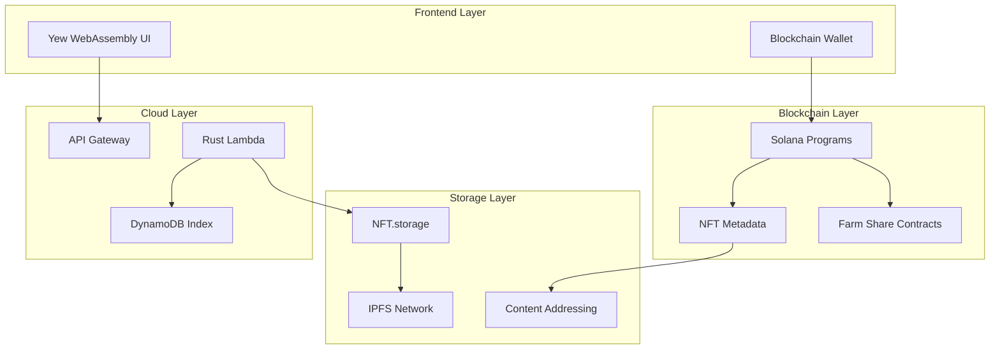
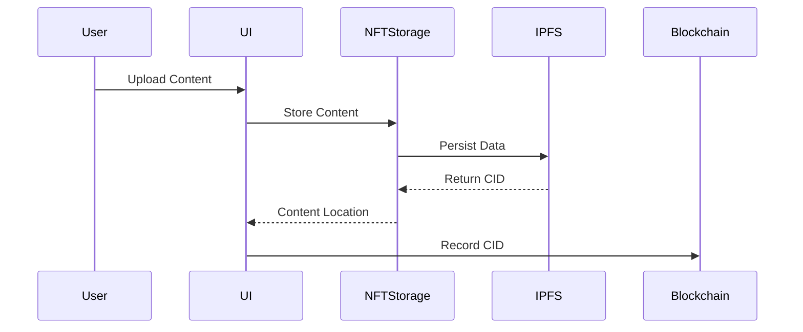

# Field 2 Table (f2t.io) System Architecture
## Technical Architecture Documentation

## Table of Contents
- [Overview](#overview)
- [System Components](#system-components)
- [Technology Stack](#technology-stack)
- [Storage Architecture](#storage-architecture)
- [Security Architecture](#security-architecture)
- [Integration Patterns](#integration-patterns)

## Overview

Field 2 Table (f2t.io) implements a decentralized architecture prioritizing:
- Content persistence through NFT.storage/IPFS
- Blockchain-based access control and farm shares
- FedRAMP High compliant cloud infrastructure
- Rust-based compute with WebAssembly frontend
- Minimal centralized data storage

### Core Design Principles
- Maximum decentralization
- Permanent data availability
- Content-addressable storage
- Regulatory compliance
- Enhanced user privacy

## System Components



## Technology Stack

### 1. Frontend Application
```rust
// Yew Component with NFT.storage Integration
#[function_component(DocumentUpload)]
pub fn document_upload() -> Html {
    let nft_storage = use_nft_storage_client();
    
    let on_upload = Callback::from(move |file: File| {
        let client = nft_storage.clone();
        wasm_bindgen_futures::spawn_local(async move {
            let cid = client.upload(&file).await.unwrap();
            // Store CID reference on blockchain
        });
    });

    html! {
        <div>
            <input type="file" onchange={on_upload} />
        </div>
    }
}
```

### 2. Storage Integration
```rust
pub struct StorageManager {
    nft_storage: NFTStorageClient,
    blockchain: SolanaClient,
}

impl StorageManager {
    pub async fn store_content(
        &self,
        content: &[u8],
        metadata: &Metadata
    ) -> Result<ContentIdentifier> {
        // Upload to NFT.storage
        let cid = self.nft_storage
            .store(content, metadata)
            .await?;
            
        // Record on blockchain
        let tx = self.blockchain
            .record_content(
                &cid,
                metadata.owner,
                metadata.permissions
            )
            .await?;
            
        Ok(ContentIdentifier { cid, tx })
    }
}
```

### 3. Blockchain Integration
```rust
#[program]
pub mod f2t_content_manager {
    use super::*;

    pub fn record_content(
        ctx: Context<RecordContent>,
        cid: String,
        permissions: ContentPermissions
    ) -> Result<()> {
        let content_record = &mut ctx.accounts.content_record;
        content_record.cid = cid;
        content_record.owner = ctx.accounts.owner.key();
        content_record.permissions = permissions;
        Ok(())
    }
}
```

### 4. Cloud Services
```rust
pub struct CloudServices {
    storage_manager: StorageManager,
    dynamo_client: DynamoDbClient,
}

impl CloudServices {
    pub async fn index_content(
        &self,
        content_id: &ContentIdentifier
    ) -> Result<()> {
        // Store minimal index data
        self.dynamo_client
            .put_item()
            .table_name("ContentIndex")
            .item("id", content_id.to_string())
            .item("timestamp", now())
            .send()
            .await?;
        Ok(())
    }
}
```

## Storage Architecture

### 1. Content Storage Flow


### 2. Content Access Pattern
```rust
pub struct ContentAccess {
    nft_storage: NFTStorageClient,
    blockchain: SolanaClient,
    gateway: IPFSGateway,
}

impl ContentAccess {
    pub async fn retrieve_content(
        &self,
        content_id: &str,
        user: &UserIdentity
    ) -> Result<Content> {
        // Verify permissions on-chain
        self.blockchain
            .verify_access(user, content_id)
            .await?;
            
        // Retrieve from IPFS
        let content = self.gateway
            .fetch_content(content_id)
            .await?;
            
        Ok(content)
    }
}
```

## Security Architecture

### 1. Content Security
```rust
pub struct SecurityLayer {
    encryption: EncryptionService,
    access_control: AccessControl,
}

impl SecurityLayer {
    pub async fn secure_store(
        &self,
        content: &[u8],
        access_policy: &AccessPolicy
    ) -> Result<SecuredContent> {
        // Client-side encryption
        let encrypted = self.encryption
            .encrypt(content)
            .await?;
            
        // Generate access policy
        let policy = self.access_control
            .generate_policy(access_policy)
            .await?;
            
        Ok(SecuredContent {
            encrypted,
            policy,
        })
    }
}
```

### 2. Access Control
```rust
pub struct AccessControl {
    nft_validator: NFTValidator,
    policy_enforcer: PolicyEnforcer,
}

impl AccessControl {
    pub async fn validate_access(
        &self,
        user: &UserIdentity,
        content_id: &str
    ) -> Result<AccessDecision> {
        // Check NFT attributes
        let nft = self.nft_validator
            .validate_token(user)
            .await?;
            
        // Enforce policy
        self.policy_enforcer
            .check_access(nft, content_id)
            .await
    }
}
```

## Integration Patterns

### 1. Content Management
```rust
pub struct ContentManager {
    storage: StorageManager,
    security: SecurityLayer,
    index: CloudServices,
}

impl ContentManager {
    pub async fn publish_content(
        &self,
        content: Content,
        policy: AccessPolicy
    ) -> Result<PublishedContent> {
        // Secure content
        let secured = self.security
            .secure_store(&content, &policy)
            .await?;
            
        // Store on NFT.storage
        let identifier = self.storage
            .store_content(&secured)
            .await?;
            
        // Index for discovery
        self.index
            .index_content(&identifier)
            .await?;
            
        Ok(PublishedContent {
            identifier,
            policy,
        })
    }
}
```

### 2. Farm Share Integration
```rust
pub struct FarmShareManager {
    content_manager: ContentManager,
    share_contract: FarmShareContract,
}

impl FarmShareManager {
    pub async fn create_share(
        &self,
        share_details: ShareDetails,
        content: ShareContent
    ) -> Result<FarmShare> {
        // Publish share content
        let content_id = self.content_manager
            .publish_content(content, share_details.policy)
            .await?;
            
        // Create share contract
        let share = self.share_contract
            .create_share(share_details, content_id)
            .await?;
            
        Ok(share)
    }
}
```