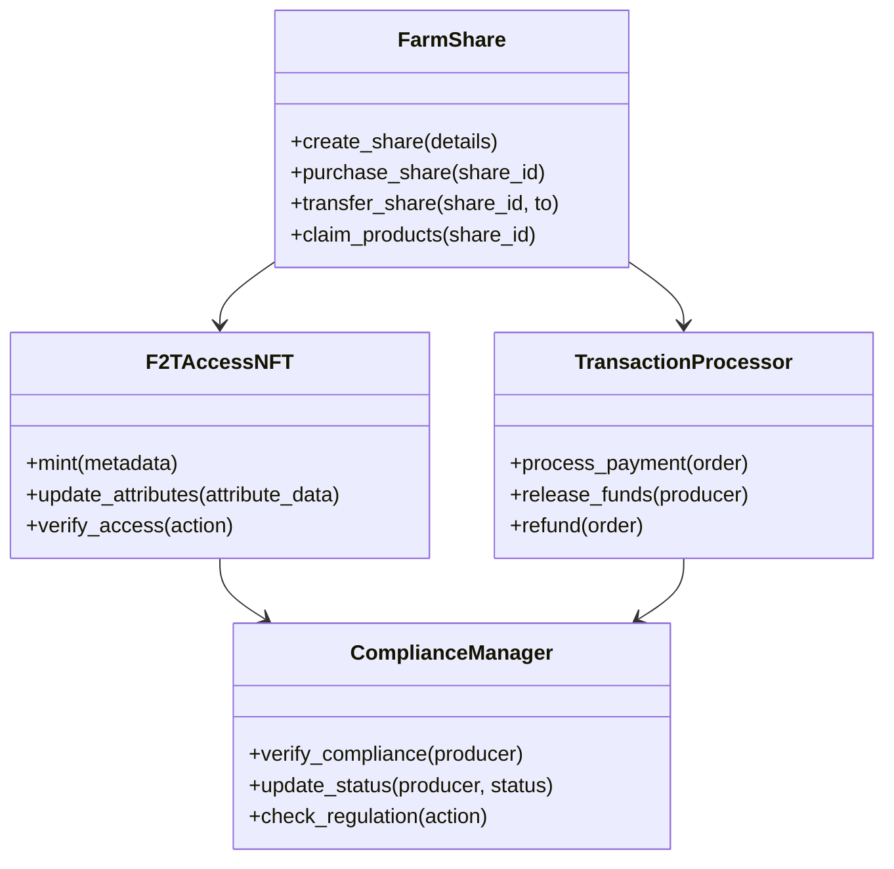

# Field 2 Table (f2t.io) Smart Contracts
## Technical Documentation for Solana Implementation

## Table of Contents
- [Overview](#overview)
- [Program Architecture](#program-architecture)
- [Core Programs](#core-programs)
- [Implementation Details](#implementation-details)
- [Security Considerations](#security-considerations)
- [Testing and Deployment](#testing-and-deployment)
- [Program Interaction](#program-interaction)

## Overview

The Field 2 Table Solana program system implements:
- Dynamic NFT-based access control using Metaplex
- Farm share management through Program Derived Addresses (PDAs)
- Compliance verification using state accounts
- Transaction processing with native SOL and SPL tokens

### Program Dependencies
```toml
[package]
name = "f2t-contracts"
version = "0.1.0"
edition = "2021"

[dependencies]
solana-program = "1.17.0"
anchor-lang = "0.28.0"
anchor-spl = "0.28.0"
mpl-token-metadata = "1.13.0"
```

## Program Architecture



## Core Programs

### 1. Access NFT Program

```rust
use anchor_lang::prelude::*;
use anchor_spl::token::{self, Token};
use mpl_token_metadata::state::{Metadata, TokenMetadataAccount};

#[program]
pub mod f2t_access_nft {
    use super::*;

    #[derive(Accounts)]
    pub struct Initialize<'info> {
        #[account(mut)]
        pub authority: Signer<'info>,
        #[account(
            init,
            payer = authority,
            space = 8 + AccessConfig::LEN
        )]
        pub config: Account<'info, AccessConfig>,
        pub system_program: Program<'info, System>,
    }

    #[derive(Accounts)]
    pub struct MintNFT<'info> {
        #[account(mut)]
        pub authority: Signer<'info>,
        #[account(
            init,
            payer = authority,
            space = AccessToken::LEN
        )]
        pub token_account: Account<'info, AccessToken>,
        pub mint: Account<'info, token::Mint>,
        pub token_program: Program<'info, Token>,
        pub system_program: Program<'info, System>,
        pub rent: Sysvar<'info, Rent>,
    }

    #[account]
    pub struct AccessConfig {
        pub authority: Pubkey,
        pub minter_role: Pubkey,
        pub admin_role: Pubkey,
    }

    #[account]
    pub struct AccessToken {
        pub owner: Pubkey,
        pub role: String,
        pub jurisdiction: Vec<String>,
        pub transaction_cap: u64,
        pub compliance_verified: bool,
        pub last_updated: i64,
    }

    pub fn initialize(ctx: Context<Initialize>) -> Result<()> {
        let config = &mut ctx.accounts.config;
        config.authority = ctx.accounts.authority.key();
        config.minter_role = ctx.accounts.authority.key();
        config.admin_role = ctx.accounts.authority.key();
        Ok(())
    }

    pub fn mint_nft(
        ctx: Context<MintNFT>,
        role: String,
        jurisdiction: Vec<String>,
        transaction_cap: u64,
    ) -> Result<()> {
        let token = &mut ctx.accounts.token_account;
        token.owner = ctx.accounts.authority.key();
        token.role = role;
        token.jurisdiction = jurisdiction;
        token.transaction_cap = transaction_cap;
        token.compliance_verified = false;
        token.last_updated = Clock::get()?.unix_timestamp;
        Ok(())
    }
}
```

### 2. Farm Share Program

```rust
use anchor_lang::prelude::*;

#[program]
pub mod f2t_farm_share {
    use super::*;

    #[derive(Accounts)]
    pub struct CreateShare<'info> {
        #[account(mut)]
        pub producer: Signer<'info>,
        #[account(
            init,
            payer = producer,
            space = 8 + ShareAccount::LEN
        )]
        pub share_account: Account<'info, ShareAccount>,
        pub system_program: Program<'info, System>,
    }

    #[account]
    pub struct ShareAccount {
        pub name: String,
        pub total_shares: u64,
        pub available_shares: u64,
        pub price_per_share: u64,
        pub start_date: i64,
        pub end_date: i64,
        pub producer: Pubkey,
        pub active: bool,
    }

    pub fn create_share(
        ctx: Context<CreateShare>,
        name: String,
        total_shares: u64,
        price_per_share: u64,
        start_date: i64,
        end_date: i64,
    ) -> Result<()> {
        let share = &mut ctx.accounts.share_account;
        share.name = name;
        share.total_shares = total_shares;
        share.available_shares = total_shares;
        share.price_per_share = price_per_share;
        share.start_date = start_date;
        share.end_date = end_date;
        share.producer = ctx.accounts.producer.key();
        share.active = true;
        Ok(())
    }
}
```

### 3. Compliance Manager Program

```rust
use anchor_lang::prelude::*;

#[program]
pub mod f2t_compliance {
    use super::*;

    #[derive(Accounts)]
    pub struct VerifyCompliance<'info> {
        #[account(mut)]
        pub authority: Signer<'info>,
        #[account(mut)]
        pub producer: Account<'info, ProducerCompliance>,
    }

    #[account]
    pub struct ProducerCompliance {
        pub verified: bool,
        pub last_verified: i64,
        pub jurisdiction: Vec<String>,
        pub licenses: Vec<String>,
    }

    pub fn verify_compliance(
        ctx: Context<VerifyCompliance>,
        jurisdiction: Vec<String>,
        licenses: Vec<String>,
    ) -> Result<()> {
        let compliance = &mut ctx.accounts.producer;
        compliance.verified = true;
        compliance.last_verified = Clock::get()?.unix_timestamp;
        compliance.jurisdiction = jurisdiction;
        compliance.licenses = licenses;
        Ok(())
    }
}
```

## Implementation Details

### NFT Metadata Structure
```json
{
    "name": "F2T Access Token",
    "symbol": "F2T",
    "description": "Field 2 Table Access Control NFT",
    "attributes": [
        {
            "trait_type": "role",
            "value": "producer"
        },
        {
            "trait_type": "jurisdiction",
            "value": ["MI", "OH"]
        },
        {
            "trait_type": "transactionCap",
            "value": 75000
        },
        {
            "trait_type": "complianceVerified",
            "value": true
        }
    ]
}
```

### State Account Seeds
```rust
// PDA seeds for various program accounts
pub const ACCESS_CONFIG_SEED: &[u8] = b"access_config";
pub const TOKEN_ACCOUNT_SEED: &[u8] = b"token_account";
pub const SHARE_ACCOUNT_SEED: &[u8] = b"share_account";
pub const COMPLIANCE_SEED: &[u8] = b"compliance";

// PDA derivation helper
pub fn derive_pda(seeds: &[&[u8]], program_id: &Pubkey) -> (Pubkey, u8) {
    Pubkey::find_program_address(seeds, program_id)
}
```

## Security Considerations

### Access Control
- PDA-based ownership verification
- Cross-Program Invocation (CPI) guards
- Signer verification

### Transaction Safety
- Atomic transactions
- Check-and-set patterns
- Proper account validation

### Program Upgrades
- Program upgrade authority management
- State migration strategies
- Version control system

## Testing and Deployment

### Test Suite
```rust
#[cfg(test)]
mod tests {
    use super::*;
    use solana_program_test::*;
    use solana_sdk::signature::Signer;

    #[tokio::test]
    async fn test_mint_nft() {
        let program = ProgramTest::new(
            "f2t_access_nft",
            f2t_access_nft::id(),
            processor!(f2t_access_nft::entry),
        );

        let (mut banks_client, payer, recent_blockhash) = program.start().await;

        // Test implementation
    }
}
```

### Deployment Script
```typescript
import * as anchor from "@project-serum/anchor";
import { Program } from "@project-serum/anchor";
import { F2tAccessNft } from "../target/types/f2t_access_nft";

async function main() {
    const provider = anchor.AnchorProvider.env();
    anchor.setProvider(provider);

    const program = anchor.workspace.F2tAccessNft as Program<F2tAccessNft>;

    // Deploy implementation
}
```

## Program Interaction

### Client Integration
```typescript
import { Connection, PublicKey, Transaction } from "@solana/web3.js";
import { Program, Provider } from "@project-serum/anchor";

export class F2TClient {
    constructor(
        private connection: Connection,
        private program: Program,
        private provider: Provider
    ) {}

    async mintAccessNFT(
        role: string,
        jurisdiction: string[],
        transactionCap: number
    ): Promise<string> {
        // Implementation
    }

    async purchaseFarmShare(
        shareId: PublicKey,
        quantity: number,
        lamports: number
    ): Promise<string> {
        // Implementation
    }
}
```

## Appendix

### A. Optimization Techniques
- Account size optimization
- Instruction packing
- Compute unit management
- Cross-Program Invocation efficiency

### B. Program Interfaces
```rust
#[derive(AnchorSerialize, AnchorDeserialize)]
pub struct ShareDetails {
    pub name: String,
    pub total_shares: u64,
    pub price_per_share: u64,
    pub start_date: i64,
    pub end_date: i64,
}

#[derive(AnchorSerialize, AnchorDeserialize)]
pub struct ComplianceDetails {
    pub jurisdiction: Vec<String>,
    pub licenses: Vec<String>,
    pub verification_level: u8,
}
```