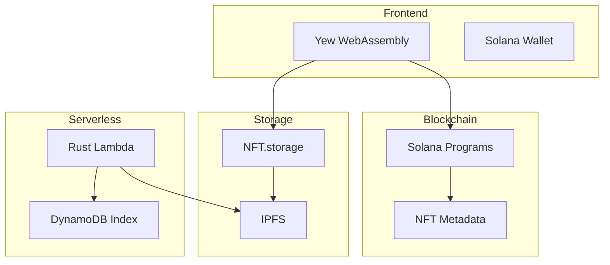

```markdown
---
title: Field 2 Table | Decentralized Marketplace
description: Revolutionizing local food commerce with blockchain-based farm shares and NFT-driven access control.
layout: default
---

# f2t_logic
# Field 2 Table (f2t.io)

[](https://opensource.org/licenses/MIT)
[](http://makeapullrequest.com)
[](https://docs.solana.com/cli)
[](https://www.rust-lang.org/)

A decentralized marketplace revolutionizing local food commerce through blockchain-based farm shares, NFT-driven access control, and automated regulatory compliance.

---

## 🌟 Features

### Core Technologies
- 🔗 **Solana Smart Contracts** - Rust-based programs for farm share and compliance management
- 🎫 **Dynamic NFTs** - Metaplex-powered role and attribute management
- 🗃️ **NFT.storage** - Decentralized content storage with IPFS
- 🌐 **Yew Framework** - Rust-based WebAssembly frontend
- ⚡ **Serverless Rust** - AWS Lambda functions with custom runtime

### Key Components
- **Decentralized Storage** - IPFS-based permanent data availability
- **Farm Share Framework** - Legal structure enabling interstate commerce
- **Compliance Automation** - Real-time verification with NFT attributes
- **Zero-Trust Security** - Blockchain-verified access control

---

## 🚀 Getting Started

### Prerequisites
```bash
# Required versions
rustc 1.75.0 or higher
cargo 1.75.0 or higher
solana-cli 2.0.16
```

### Environment Setup
```bash
# Install Rust
curl --proto '=https' --tlsv1.2 -sSf https://sh.rustup.rs | sh

# Install Solana CLI
sh -c "$(curl -sSfL https://release.solana.com/v2.0.16/install)"

# Install WebAssembly tools
cargo install wasm-pack
cargo install trunk
rustup target add wasm32-unknown-unknown
```

### Development Setup
```bash
# Clone repository
git clone --recurse-submodules https://github.com/yourusername/f2t.git
cd f2t

# Install workspace dependencies
cargo build

# Configure environment
cp .env.example .env
# Edit .env with your configurations

# Start development server
trunk serve
```

---

## 🏗️ Project Structure

```
FlexnetGX/
├── GX-mobile/             # Mobile application development
├── GX-web/                # Web application frontend
├── GX-lambda/             # Serverless functions for backend
├── GX-blockchain/         # Blockchain programs
└── lib/                   # Shared Rust libraries
```

### Categories:
1. **GX-mobile**: Cross-platform mobile app for consumers and producers.  
2. **GX-web**: WebAssembly-based frontend using Yew.  
3. **GX-lambda**: AWS serverless backend for compliance and APIs.  
4. **GX-blockchain**: Solana smart contracts for farm shares and access control.  
5. **lib**: Shared Rust libraries for reuse.

---

## 🔧 Development

### Smart Contract Development
```bash
cargo build-bpf
cargo test-bpf
solana program deploy target/deploy/farm_share.so
```

### Frontend Development
```bash
trunk serve
trunk build --release
```

### Lambda Development
```bash
cargo lambda build
cargo lambda watch
cargo lambda deploy
```

---

## 📖 Documentation

- [System Architecture](./docs/architecture.md)
- [Access Control](./docs/accessControlSystem.md)
- [Smart Contracts](./docs/smartContracts.md)
- [AWS Integration](./docs/awsIntegration.md)
- [API Reference](./docs/apiReference.md)

---

## 📊 Technical Architecture



---

## 🤝 Contributing

See our [Contributing Guide](CONTRIBUTING.md) for development standards and testing.

---

## 📜 License

This project is licensed under the MIT License. See the [LICENSE](LICENSE) file for details.

---

## 📞 Contact

- [Twitter](https://twitter.com/f2t_app)
- Email: support@f2t.io

---
Built with 🦀 Rust and ❤️ for local food communities.
```
